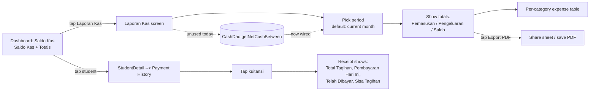

# PRD — Laporan Kas Sederhana & Penyempurnaan Kuitansi

**Project:** TKManagement (com.lelestacia.tkmanagement)
**Status:** Draft v1 · **Date:** 2026-09-01
**Source requirement:** "Fokus awal: fitur inti saja" — core-feature list (ChatGPT spec, 2026-09-01)

---

## 1. Problem & Audience

TKManagement was built against an 8-item core-feature list. Six items are fully
shipped; three are **not implemented**:

| # | Requirement (from spec) | Current state | Gap |
|---|--------------------------|---------------|-----|
| 1 | Input pemasukan: pendaftaran, SPP, cicilan, pelunasan | SPP/cicilan/pelunasan work; `FeeType` has `PEMBANGUNAN, SPP, SERAGAM, BUKU, KEGIATAN, LAINNYA` | **`PENDAFTARAN` missing** — the KDoc in `FeeType.kt` even lists it, but no enum value exists; registration fees are forced into `LAINNYA` |
| 2 | Cetak kuitansi: *total biaya, pembayaran hari ini, total sudah dibayar, sisa tagihan* | `ReceiptScreen` prints "Total Tagihan" + "Telah Dibayar" | **"Pembayaran Hari Ini" and "Sisa Tagihan" rows missing** |
| 3 | Laporan kas sederhana (total pemasukan/pengeluaran) | Dashboard shows live saldo + totals; `CashDao.getNetCashBetween()` exists but is **unused dead code**; no period report, no export | **No period-based report screen and no report export** |

**Audience:** the school operator/treasurer (single-user, on-device, Indonesian UI).

## 2. Desired User Outcome

The operator can close a month using only the app: open **Laporan Kas**, pick a
period, see total income / total expense / net balance, and export it as a PDF
to share or file. Any receipt handed to a parent shows *what was paid today* and
*what remains*, so no arithmetic is done by hand. Registration fees are recorded
as their own line item instead of being hidden under "lainnya".

## 3. V1 Scope (max 5 items)

1. **Laporan Kas screen** — period picker (month default), shows **Total Pemasukan,
   Total Pengeluaran, Saldo Kas** for the period. Backed by the existing
   `CashDao.getNetCashBetween()` + `PaymentDao.getTotalIncomeAllTime()` /
   `ExpenseDao.getTotalExpenseAllTime()` (scoped to period) + per-category
   expense table via `ExpenseDao.getByCategory()`.
2. **PDF export of the report** — reuse the `FileExportUtils` PDF pattern
   (`ReceiptReportGenerator`-style header/table/footer).
3. **Receipt detail rows** — add **"Pembayaran Hari Ini"** and **"Sisa Tagihan"**
   to `ReceiptScreen` (single) and `FullReceiptScreen` (full). `Sisa Tagihan =
   Total Tagihan − Telah Dibayar`, computed from existing `FeeWithPayments` data.
4. **`FeeType.PENDAFTARAN`** — add enum value, fix the KDoc drift; it flows
   automatically through converters, chips, and AddFee/AddBulkFee.
5. **Navigation entry** — add "Laporan Kas" destination (`NavGraph`) reachable
   from Dashboard; card on Dashboard links to it.

## 4. Primary Journey

## 5. Acceptance Criteria

1. From Dashboard → **Laporan Kas** → pick a month: screen shows Total
   Pemasukan, Total Pengeluaran, Saldo Kas that exactly match a manual
   `SELECT SUM(amount) FROM payments/expenses WHERE date BETWEEN …` over the same
   period (verifiable with a direct Room/DB query — no invented figures).
2. **Export PDF** produces a file containing the period header, the three totals,
   and the category breakdown; opens the Android share sheet.
3. `ReceiptScreen` shows all four lines — Total Tagihan, Pembayaran Hari Ini,
   Telah Dibayar, Sisa Tagihan — and `sisa = total − dibayar` holds for every
   test fixture (incl. partial payments and fully-paid fees).
4. `FeeType.PENDAFTARAN` is selectable in AddFee and AddBulkFee and renders in
   chips/filters without crashing Converter or enum-exhaustive code.
5. **No regression:** dashboard saldo, tunggakan ordering, and existing PDF
   receipts still pass their current behavior (CashDao itself is untouched).

## 6. Non-Goals

- No per-category **income** breakdown / multi-period charts / comparisons.
- No physical-printer integration — PDF + share sheet only.
- No WhatsApp/bank payment integration, no auth/roles, no cloud sync.
- No changes to the cash model (`Saldo = Σ payments − Σ expenses` stays live).

## 7. Constraints & Assumptions

- Single Room DB on-device; `BigDecimal` money everywhere (no doubles).
- Dates stored as epoch millis (`payment_date`, `expense_date`) — period filter
  is `BETWEEN startMillis AND endMillis`.
- Report generator follows the existing `FileExportUtils`/PDF code style.
- UI copy in **Indonesian** (`Laporan Kas`, `Total Pemasukan`, `Pembayaran Hari
  Ini`, `Sisa Tagihan`); code/comments English, matching current codebase.
- Assumption: month = calendar month (UTC+7 local), default period for v1.

## 8. Success Signal

A month-end close can be done entirely in-app (report + exported PDF + receipts
with remaining balance), with the cash figure matching a manual SUM of the
ledger — no spreadsheet reconciliation for the core number.

---

*Gap analysis performed 2026-09-01 against `graphify-out/graph.json` (507 nodes) + source inspection. Findings for items 1–6 of the spec were verified in code (FeeType.kt, ExpenseCategory.kt, CashDao.kt, FeeDao.kt L97, TunggakanScreen.kt, StudentDetailScreen.kt).*